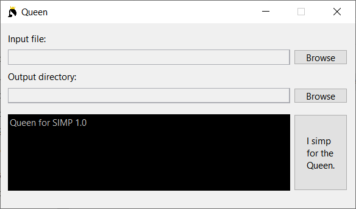

# SIMP
A higher level language that translates directly into MIPS assembly code via the Queen interpreter.  
Current version: **1.0**

More detailed documentation is available in `simpapi.pdf`.



## Sample Program

```
// isPrime($a0): returns 1 if $a0 is prime, returns 0 otherwise.

$a0 = 15
jal isPrime()
exit

func isPrime():
	$t0 = 2
	while $t0 < $a0:
		$t1 = $a0 % $t0
		if $t1 == $0:
			return 0
		end
		$t0 = $t0 + 1
	end
	return 1
end
```

To build a SIMP program, write your code and save it in a file with the `.simp` extension. Run Queen and browse for the SIMP file and an output folder. Click on "I simp for the Queen" to export the translated `.asm` file.

## Registers
Only the following registers can be used in SIMP:  
- $zero
- $v0 - $v1
- $a0 - $a3
- $t0 - $t9
- $s0 - $s8
- $gp, $sp, $fp

Register $ra is automatically managed by Queen.

## Math
Equate (reg **a**, reg/imm **b**)  
`a = b`  
Negate (reg **a**, reg/imm **b**)  
`a = !b`  
`a = not b`  
Addition (reg **a**, reg **b**, reg/imm **c**)   
`a = b + c`  
`a = b add c`  
`a += c`  
Subtraction (reg **a**, reg **b**, reg/imm **c**)   
`a = b - c`  
`a = b sub c`  
`a -= c`  
Multiplication (reg **a**, reg **b**, reg/imm **c**)   
`a = b * c`  
`a = b mul c`  
`a *= c`  
Integer Division (reg **a**, reg **b**, reg/imm **c**)   
`a = b / c`  
`a = b div c`  
`a /= c`  
Modulo (reg **a**, reg **b**, reg/imm **c**)   
`a = b % c`  
`a = b mod c`  
Shift Left Logical (reg **a**, reg **b**, reg/imm **c**)   
`a = b << c`  
`a = b sll c`  
Shift Right Logical (reg **a**, reg **b**, reg/imm **c**)   
`a = b >> c`  
`a = b srl c`  
Shift Right Arithmetic (reg **a**, reg **b**, reg/imm **c**)   
`a = b >>! c`  
`a = b sra c`  
Bitwise AND (reg **a**, reg **b**, reg/imm **c**)   
`a = b & c`  
`a = b and c`  
Bitwise OR (reg **a**, reg **b**, reg/imm **c**)   
`a = b | c`  
`a = b or c`  
Bitwose XOR (reg **a**, reg **b**, reg/imm **c**)   
`a = b ^ c`  
`a = b xor c`  
Boolean (reg **a**, bool **exp**)  
The following are valid for **exp**: (reg **b**, reg/img **c**)
- `b == c`
- `b != c`
- `b > c`
- `b >= c`
- `b < c`
- `b <= c`

You cannot combine multiple operations into one expression.  
Ex. `a = (b + c) > (d - e)` is invalid.

## Data
The optional third parameter is defaulted to zero offset if unused.  
Load address (reg **a**, label **b**)  
`a.la(b)`  
Load word (reg **a**, reg **b**, *optional* imm **c**)  
`a.lw(b)`  
`a.lw(b + c)`  
`a.lw(b - c)`  
Store word (reg **a**, reg **b**, *optional* imm **c**)  
`a.sw(b)`  
`a.sw(b + c)`  
`a.sw(b - c)`  
Load byte (reg **a**, reg **b**, *optional* imm **c**)  
`a.lb(b)`  
`a.lb(b + c)`  
`a.lb(b - c)`  
Store byte (reg **a**, reg **b**, *optional* imm **c**)  
`a.sb(b)`  
`a.sb(b + c)`  
`a.sb(b - c)`  
Push word in register to stack (reg **a**)  
`stack.push(a)`  
Pop word from stack into register (reg **a**)  
`stack.pop(a)`

## Conditionals
`if` block
```
if exp:
    // code
end
```
`while` block
```
while exp:
    // code
end
```
`exp` may be replaced with any of the valid Boolean expressions.  
All conditional statement blocks must end with the `end` keyword.

## Functions
Function definition
```
func name():
    // code
    return
end
```
All functions must end with the `end` keyword. `return` is optional and can be used to jump back to the code that called the function.  
A register/immediate may be returned into $v0.  
`return $t0`  
`return 10`  
To call a function without jumping back:  
`j name()`  
To call a function that returns a value:  
`jal name()`  
Using `j` on a function that returns a value may cause problems.

## Extras
Exit the program (syscall 10)  
`exit`  
Line comment (preserved in `.asm`)  
`// comment`  
Inline assembly  
`asm: add $t0, $t1, $t2`  
Queen does not check if the inline assembly is valid MIPS code.